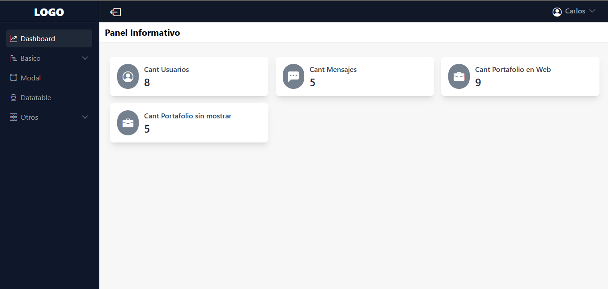
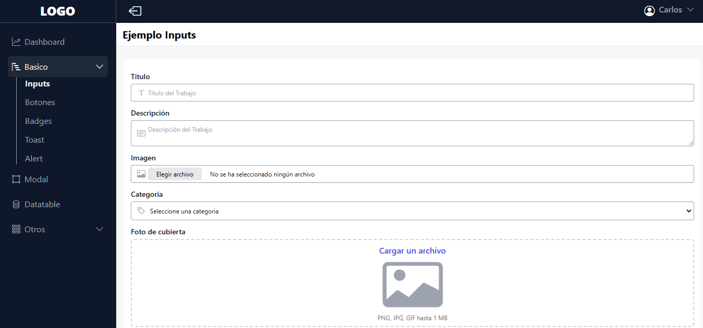
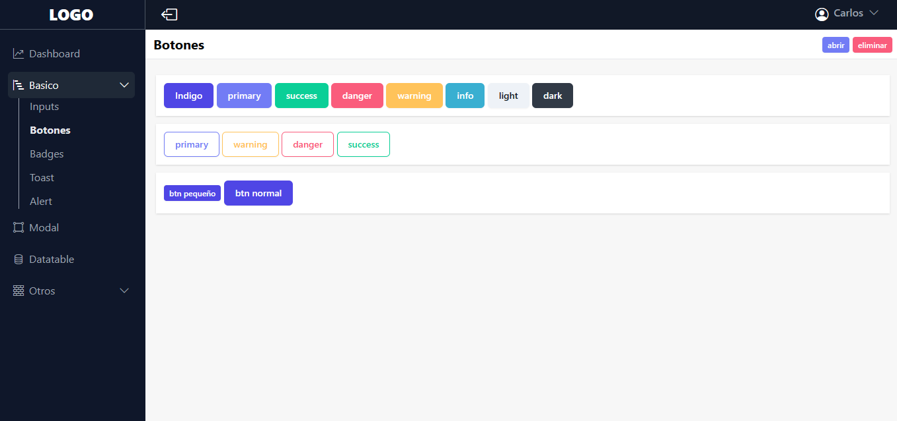
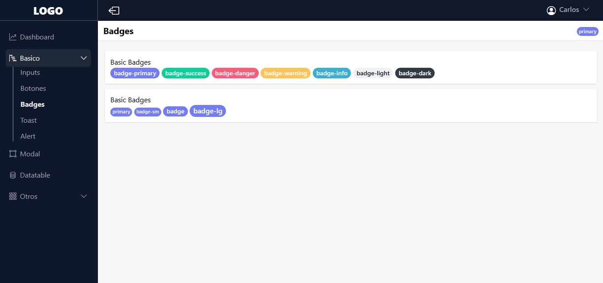
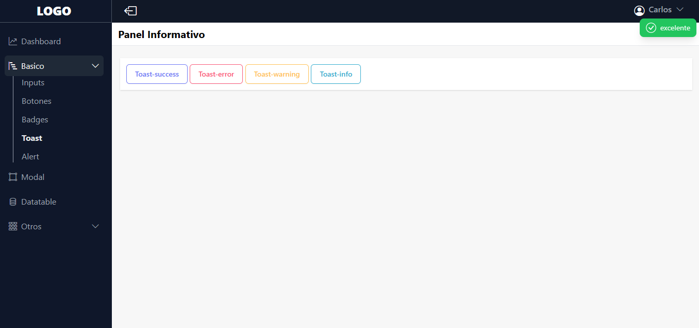
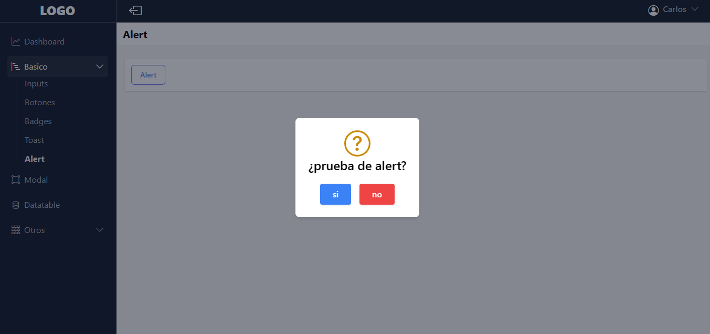
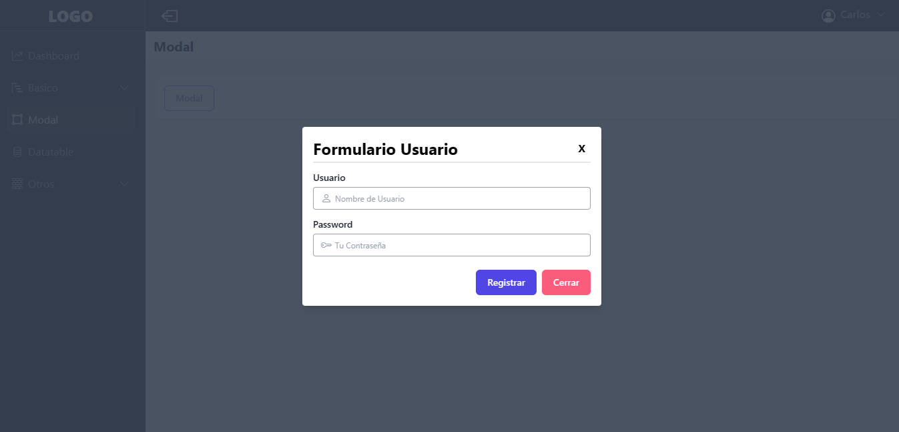
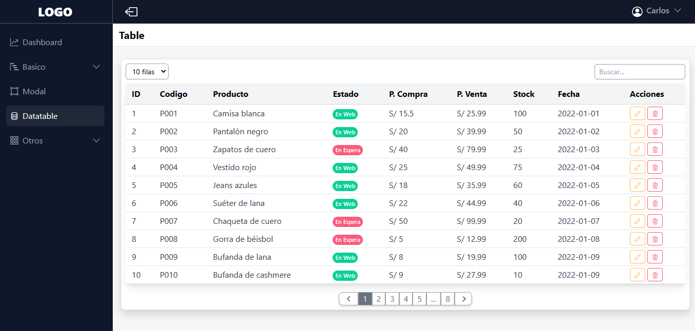

# CRONOS DASHBOARD

```
npm install
npm run dev
```

## Descripción

- realizado con tailwindcss y javascript
- dashboard responsive

## Imagenes

### panel



### imputs



### botones



### badges



### toast



### alert



### modal



### datatable


